# Ascendia 🪽

<div align="center">

**AI-Powered Business Intelligence Hackathon Project**

*AWS AI Agent Global Hackathon Submission*

[](https://aws.amazon.com/bedrock/agentcore/)
[](https://nextjs.org/)
[](https://www.python.org/)
[](https://aws.amazon.com/cdk/)

[Features](#-key-features) • [Architecture/Diagrams](#%EF%B8%8F-architecture) • [Quick Start](#-quick-start) • [Demo](#-demo) • [Showcase GIFs](#-showcase-gifs)

</div>

---

## 🎯 Project Overview

**Ascendia** is a full-stack AI-powered business intelligence project built for the **AWS AI Agent Global Hackathon**. It demonstrates the power of AWS Bedrock AgentCore primitives (Memory, Identity, and Agent Runtime) integrated with a comprehensive AWS services ecosystem.

### 💡 What Makes This Unique?

Unlike traditional chatbot interfaces, Ascendia features **agent-driven dynamic UI** - the AI agent doesn't just respond with text, it **actively controls and updates the user interface in real-time** through WebSocket connections. The agent can:

- 🎨 Push interactive UI components (carousels, cards, charts)
- 📊 Create data visualizations on-demand
- 🔔 Send notifications and progress updates
- 🎯 Highlight and guide user attention to specific UI elements
- 💾 Persist data and maintain conversation context
- 🔍 Transparent output from the Agent


### 🎓 Hackathon Goals

This project showcases:

1. **AgentCore Primitives Integration**
   - **Memory**: Conversation history and context retention
   - **Identity**: Secure API key and credential management
   - **Agent Runtime**: Scalable, serverless agent execution

2. **AWS Ecosystem**
   - Cognito for authentication and row-level security
   - DynamoDB for data persistence
   - WebSocket API Gateway for real-time bidirectional communication
   - Lambda for serverless compute
   - CDK for infrastructure as code

3. **Tranparency in Agent Responses**
   - Displays AI agent reasoning trail
   - Displays tool calls and payload
   - Toggleable for UX

4. **Real-World Use Case**
   - Competitive intelligence gathering
   - Market research automation
   - Business insights generation
   - Interactive data visualization

---

## 🏗️ Architecture

> **📌 Note**: Click diagrams to zoom. GitHub Mermaid renders at auto-size - wider diagrams display larger.

> **📝 Mermaid Chart Viewer**: You can click the "View at Mermaid Chart" link for a respective diagram for a better viewing experience


### System Architecture ([View at Mermaid Chart](https://mermaidchart.com/play?utm_source=mermaid_live_editor&utm_medium=share#pako:eNqNVd1qE0EUfpVhBKmYpJts05hFCsnW2mKV0o0UTESmu9Nk7O7MMjubdG16561_KIjeFMELH8Hn8QX0ETwz-9MtkWJucub8fuc75yTn2BcBxQ6eShLP0Gg44Qg-SXqcKybYDRnlCu2TjMoJzs368zShcvzn8sN3I6GhFAv4fn7lcESPB3E8fkLPVOtlgnak4Iry4P6xXN86pMRXqN1Hd9Eoi6nnSxarIhZ8JnwFxiBVM8DBfKKY4Og2GhzsoYdE0QXJ6rBcMeVMifHgyCtlU9GAPBAihJJ7gc6kMvOuI_aKhGPA7gn_lKp6mRJ52FQsomjIAiapr-GQ8GbsgGVIAwkZ0WAKtV0haR10pRwbyQcJeVTOmU9r8B7TSMgMOP_4FV355VqDzRV8TmWSM7TLEgWGWnzZNmT49L6WodSbHLrfRzRDjwknUxqBpZbhMOW69fGvr19-_3xXS2Gk0mzyeEoSHuixk4guhDy9mSETP4JxJNd2bM-oAPDbH_BAT-MARpH7mSrJTCxe-CKKKTQgZE3JeMKmM3WlMKWSWjMjMmehIeNNIethmwAYP_BPpD-DRXMlWej53oR_j59IkiiZ-iq9Ptp9Eh0HBBj7VohoJ-VmaZKyVLFpu8BXCOOrQdzOOInE9nC89ufy82tNeakp5h3FhDOaVK86DbANPF_P5M4q-eYems2t5e5odOCtH3nesrjY3J7L6L520be3LK9p1Vy1sLy6oFUvTdJcnJa7suZ5D-7ALQ6BZkCiS0zwsnYeBc4qowZbUFjaKmdjyw_hX5Zywf9lK3a2TFk8janYvlVDvi0Vk7kbaragy4M0mRVrmlyjI_ctOMx9D8WiuU_nNIRd81MJAJfVfKsdU1lIa5BPWBg6t1y3N7CsBiwcEOrc6tidHftB8WwuWKBmjh2f1TOUIPN4y-r3XffG-M71-LL9_64P8bgB_yoswA7cBW3giMqI6Cc-15knGH7QgXjsgBjQE5KGSh_OBYTBVj8TIiojpUinM-yckDCBV2rY3WYEji-qtBJ2m0pXAE7sbLR7HZMFO-f4DDudzW6rZ29uWHav0wFbt9vAGajtdqvb63Xa9_p9y7Yta-OigV-Zwlar37U3IOZer91r9-3N9sVfbnJgtg))

```mermaid
graph TB
    subgraph "Client Layer"
        User[👤 User Browser]
        WebApp[Next.js Frontend<br/>React 19 + TypeScript]
    end

    subgraph "Authentication & API Gateway"
        Cognito[AWS Cognito<br/>User Pool + Identity Pool]
        WSGateway[WebSocket API Gateway<br/>Real-time Bidirectional]
    end

    subgraph "AWS Bedrock AgentCore"
        AgentCore[Agentcore Service]
        Memory[📚 Agentcore Memory<br/>Conversation History]
        Identity[🔐 Agentcore Identity<br/>API Key Management]
        Runtime[⚙️ Agentcore Agent Runtime<br/>Strands Framework]
    end

    subgraph "Agent Tools"
        UITools[🎨 UI Update Tools<br/>show_competitors<br/>show_insight<br/>show_graphs]
        Tavily[🔍 Tavily API<br/>Web Search & Crawl]

    end

    subgraph "Infrastructure"
        Lambda[⚡ Lambda Functions<br/>WebSocket Handlers]
        DynamoDB[(🗄️ DynamoDB<br/>Companies<br/>Competitors<br/>Connections)]
    end

    User -->|HTTPS/WSS| WebApp
    WebApp <-->|Auth| Cognito
    WebApp <-->|WebSocket| WSGateway
    WebApp <-->|"Invoke Agent (SSE) + Bearer Auth"| AgentCore

    WSGateway --> Lambda

    AgentCore --> Memory
    AgentCore --> Identity
    AgentCore --> Runtime

    Runtime --> UITools
    Runtime --> Tavily

    UITools -.->|Push Updates| WSGateway

    Cognito -.->|Row-Level Security| DynamoDB

    style AgentCore fill:#CC7A00,stroke:#232F3E,stroke-width:3px
    style UITools fill:#0099CC,stroke:#232F3E,stroke-width:2px
    style Runtime fill:#CC7A00,stroke:#232F3E,stroke-width:2px
```



### Agent-Driven UI Update Flow ([View at Mermaid Chart](https://mermaidchart.com/play?utm_source=mermaid_live_editor&utm_medium=share#pako:eNq1VU1v2zAM_SuCzknXxMmSGEWBLUGBXoaiaVFgCBAwNmsLlSVPkpO6Rf_7KDt2vtauh803UXzkI0U-v_JIx8hDbvFXgSrCmYDEQLZQjL4cjBORyEE5dm_RnFqvjFYOVXx684CruY6e0J1efUtQuak2eHp1p7W0p-ZZqSDTs-8LVd95Mt3LyyZ7yBb8SqiYRTrL0QmnjWWP2rCsZHOA-YLXsMb_4qJL6JZhyK6VcAIcsg2ubGWjUEph5IRWh1gCtvw9cK2fkIG3sI1wKaM2mrLhCRRg7eMeldweKVpVcuhLYg7WQpZLi2CitPasbruHSW9hs1cpi8FBk_CdwDvvJSiQpRW2QfzQRE-v0eywnS2yMrAYIxGjZU6zIo99MffXR9ya5wnZFboopXTGoM21ioVKPuhpg-vu2D60ztPWmYn4g_qmICWzqd4s915_n-DBS98UlviB0YVFuW2dd21dDsbqFkF2nch8zdvqT6bBz2LIZsLmEkomyGyqZ8c2zafIC2VFkrqPiW-dfOTY_lvi1hlySkTUJLGfor0CsyTByNO_dDylbf4P7V4LW4AUL1AP1THhg-hzZxAy5vDZsXo87TZ8jH9a1HdST2nKJJLr_lPjc45GeAE9qq-Wmh2JOzSZUO9LzfFS-pydHZz64qdcK2JpGeWkTXYXK_PlEkj-wJAURRFaK1YSqTlAW6slvRGpqaoG0VXSebCz3sIsrGnH9_XTpVhSZzBjG21cWlaC6h3ACFtRdU2M4yJrFfAhTyV5ujvfeE68wxMjYh46U2CHZ9Qf8Ef-6lux4EQjwwX3Eh_jIxTSeTV_IxiV9FPrrEHSriUpDx9BWjrV07P9m7VWQ_TQTHWhHA-DQVAF4eErf-Zhv9876036veA8GIxH_dH4a4eXPBxMzsbBJAiC4bA_GY57bx3-UmU9PxtPhoNgPBz2Juf90aj39htMIYVS))


### Data Flow Architecture ([View at Mermaid Chart](https://mermaidchart.com/play?utm_source=mermaid_live_editor&utm_medium=share#pako:eNptk1GTmjAUhf9KJn1VB0Wr8NCOy7q7rLoqynZa9CGFqzILxAnB1aL_vSEBizP1ycv57jnJvZBjnwaATbyN6Ke_J4yjibNOkPgNPTcFhhYZsPMGNZvf0EM-zPgeEh76hIc0uSrwoRAv7yQKgwuyvB_we0n9D-DIokkCfkFu6qSdHBX76BV-aMQYZYJQjCWjRt5wJ4KQYKkKKy1GUn7KpWxRBsjJxIFiuFYGT5J49qYQU3ZGDnAWgkgsDZ6l_OKJw3E4ietSEoTJbnPfbnt2UFyUn5G1B_-jbLal-OoN5zYaw725Il4kMS6PP2fUhzRV_oX8quSKHstykq8ojdDoBH5WzlXJEzmvJRDm7y9o6q3IMYzOSKRv6oBrI_cQEA4XNKuNX2EKnMqguedAmkU8Ldvf1NMKmstykSsz5Nrfyw0vZMxPSEWAgHmtdrxVMUXhe6BJCpt6wxv9n66ImcxaigORqFnsD91uUXo4iqgalrJcqZfSFrtjW-L_81OTdKutLzllZFdZuVJ8L3Z-BJbK9wktyRGCW3_KzxGI5W_DKDK_WFZ_qGl1ZVwqmmYYllVXZncKbuAdCwNscpZBA8fAYlKUOC961lh8PzGssSn-BrAlYhlrvE6uou1Akl-UxlUno9luj80tiVJRZXIyjyHZMRLfnjJIAmAWFV8ANvVuX5pgM8cnbHY67Vbb6LR1Te8O-p3-4GsDn7HZNVoD3dB1vdfrGL1B-9rAf2Sq1hoYva4-6PXahtbp99vXv3eZQfI))


### Agent Tools & Swarm Architecture ([View at Mermaid Chart](https://mermaidchart.com/play?utm_source=mermaid_live_editor&utm_medium=share#pako:eNqdWFtrG0cU_ivDhkAMlq1LFFkiBBzZbkzrxI0cAo2KGe2OpMF7ETOzlpUQ6EPfWkpoSh8KpVD62j_VX9Cf0DO33dndkUKzD_bOuc7MOd85Z_UuCLOIBKNgwfBqia6eTlMED89nmjANLjBN0fGCpGIaaKZ8JFUR30yDf__461f0NOc0JZyj4xTHGy7QCxYuCRcMi4xp_cczdvjkwXGC32Ypep7dYnTJsj1FVX8moEYSSUxWYqRILTSGBU436DydZyzBgmap4VyQJGMbEEgFuROGeJVlMciC3zyUsnwafDtNnX0rJbXpj7_pbY0zRgxdGQGDt4Rx5Qo9o1w4DOkJvSSCUXKLY2XbWj6PwBYV2vYvHxzblqOMHF-eoy_JhuvLuMK3NN7sIyLCg736Vu0Vo9ZBnOGIH7SemH36hZjeF1GC1qkWJWlkTTuhlXdLQIjeEjgUJxhCpm6Qu6E-o2kkJeFgc3i9Do1WxvQh4LQ_oQlNFzFx4qz-SFWOnqMkg4RgJIZLM2zHCJKZs1DUNZkhvY3aXUj_OrEoh32U2tfYUM1WPvyu94Ama8yScicJvrte4jTK5nM-Qt12QaSCMBVqIPcVVdCEZLkYoc5Ru54-zuUpByP0EE1WJKQ4pm9JpH1Xbk8-LyCfbilZv9FXLtPZkpRHe_eElRv-57s_0bOvUZyFZc5L2mmyirMNISjMcnOXknxBOQexw1sq_1USUz6AqQgAARswb4eXjIb22rf5N7LcISgliGdE4pJ8RrDIGeENtyeAHkZnuTwB-HaXh8d5REkakp07GEPMUtfVFWYLIlCC2Q1xNjYhi0TffP3g-SyGPStYFu-HE4mNxKbqVuc5YD8hDDJXhsq5BmUIrQgLyaoSnYlgJF2IJT9cE3wj62HtVhwg1vMaPW4Bbm1ilDKWAvwDk8IS4CY4pZwh1MTcOy9lXWrdrr0l2Kfw2yz3OBU7LDWPUtjeKekvVq_O0atVhAXRFQo96HT3XKBFlBFV8osmJp_JMlub4sXhtVG8zlOJ_1CVwBCzLOekWtalAegndLEU1gbVS92zZIMjC8gGQ5VWoh1l4wvdZ_URBnv1UjEBuMOOrCuul9dKWzm8zDiVp1QwxKtmxj_FhfYMu5qq9DDKbVN0lb6C3m21Ynh31K4go6OmxksclY6YXDg6F3ksaCuSEJPlqNYpVSbQwt-Kuu4uFLIRX2JGmvUkyxfLNC8iEZm1o1_J98bd5LNZXDieqZWj2zuRTUp3gyVd7UTu80zQ-caaSuWKOqX6KsPQ8nBMWK0oAaIWUCp5cXqzVlovVqYZIS6gpFY1n0F6xSYPl_b9GppqUcgAIjJdUmVhkdOovEE_ps6YHGmA9UkcvZ68JCEBlMiYQ5vmWQhhaoUxlc4PZ-yJ4SPYRK5wypFYMhkg9NrKb4fFK06YwuIch6QOinEB2rGBqG4mqxhvuMNtZqlBrk_NsJo6CqE-DcVoyhdxkRvJUtmGQKugYsgxVLKaOWUXxRXg0PRLSZHywo2h8MTx9A7UAGbN4e1qSdMbMCXkfzMj_fw3THuYqxpS2Y6eRieqGUodtbzWzdHo_vhBRtMd0qrKY4bXcakbyqVR_fg9usQLgmCENkf06J9qZmnBSFsbP-h5HwY8qGXcPYA_w-GzgWH9NZCzSmK9nnwBSbrGEsNwpIlKUATjuZkJcNySM4KTzz5X9--rERxhNXSGGUwr5rsjrY3n0ObsJO3juZOAj28b2TaeSWcvWzcRHwuahY8s24GProq-jwHl3Ee29drrWlVfH0eXVq8bUyx9vAJwPqaCgRMz9ZnYiJaNj1ZxwLCVrdJ9K9cks_VbDHJ-8x62Y97DrZm3s5rfepPrGG8ya7YrU57fwRYRx8sWifoxihlxy0E8fPcoHnbNA8TfaVKrnC-RyFBRA7SQxRt8V0sJOaUWFaOUMKjbIaSxt10AELidKXG4navQuJ0NmNzOtMjcsTGFz-18jdId7g1Wt0sUiPWLFMEqxociVsXcklYqecWOnVesjF07Qs25YodwbZTYIVkZIHbIeQYHN0Wh-cNHhZkHYNpfU7GExNUCtWFBfk9ZWfXzT3Wesn1RbCCiZWWc0zge3RuPB8ft9j5gM7sho3vdXvesd2qWrTWNxHLUW925FipfrdpIuz0cjsc7jXSrRoqCpg30-4PBycn_MWCL1ufqV8rRZ2-iKDefa6HMXnuTx8ePHn3KQrAfLBiNghGMNmQ_SAhLsFwG76RtOe_BZ8E0GMFrROYYvsfk7PMe1FY4_SbLEqupJvRgNMcxh5UuiicUw_yUFFT5BUjYWP7gFIx6_Y4yEozeBXfBqNvtHHSG3U6v3Xt4NOgOjh7tB5tg9HB4cNQb9nq9fr877B913u8Hb5XX9sHRsP-wd9Tvd4bt7mDQef8f_zd9Hg))

```mermaid
graph TB
    subgraph "Main Agent"
        MainAgent["🤖 Business Analyst Orchestrator Agent<br/>(Amazon Nova Pro)<br/><br/>System Prompt:<br/>- Company Information<br/>- Memory Context<br/>- Tool Instructions"]

        Memory["📚 AgentCore Memory<br/>Conversation History<br/>Context Retrieval"]
        Identity["🔐 AgentCore Identity<br/>API Keys<br/>(Tavily, etc.)"]

        MainAgent -.loads.-> Memory
        MainAgent -.retrieves.-> Identity
    end

    subgraph "Competitive Research Tools"
        FindComp["find_competitors<br/>🔎 Single Agent<br/><br/>Finds N most relevant<br/>competitors using<br/>web search"]

        CompAnalysis["competitor_analysis<br/>🐝 Agent Swarm<br/><br/>max_handoffs: 20<br/>max_iterations: 5<br/>timeout: 180s"]

        subgraph "Swarm: 4 Specialized Agents"
            Overview["Company Overview<br/>Researcher<br/><br/>• HQ location<br/>• Employee count<br/>• Mission/vision"]
            Product["Product/Pricing<br/>Researcher<br/><br/>• Products<br/>• Pricing models<br/>• Features"]
            Distribution["Distribution/Audience<br/>Researcher<br/><br/>• Channels<br/>• Target markets<br/>• Segments"]
            Publicity["Publicity/Sentiment<br/>Researcher<br/><br/>• Customer reviews<br/>• Public perception<br/>• Strengths/weaknesses"]
        end

        CompAnalysis <--> Overview
        Overview <-.handoff.-> Product
        Product <-.handoff.-> Distribution
        Distribution <-.handoff.-> Publicity
	Product <-.handoff.-> Overview
	Distribution <-.handoff.-> Overview
        Publicity <-.handoff.-> Overview
    end

    subgraph "UI Update Tools (12)"
        direction TB
        ShowComp["show_competitors<br/>Interactive carousel"]
        ShowInsight["show_insight<br/>Strategic insight cards"]

        subgraph "Graph Tools (7)"
            Scatter["show_scatter_graph<br/>Positioning maps"]
            Bar["show_bar_graph<br/>Comparisons"]
            Line["show_line_graph<br/>Trends"]
            Radar["show_radar_graph<br/>Multi-dimensional"]
            Pie["show_pie_graph<br/>Market share"]
            Doughnut["show_doughnut_graph<br/>Distribution"]
            Bubble["show_bubble_graph<br/>3D relationships"]
        end

        Notify["show_notification<br/>Toast alerts"]
        Progress["show_progress<br/>Operation status"]
        Highlight["highlight_element<br/>UI attention guide"]
    end

    subgraph "Frontend"
        direction TB
        WSReceiver["websocket-client</br>Receive UI updates through Websocket"]

        subgraph "UserInterface"
            CompetitorCarousel["Displays Competitors"]
            InsightCarousel["Displays Insights"]
            GraphCarousel["Displays Graphs"]
            HighlightComponents["Highlightable Components"]
        end
        UserInteraction["User"]	
    end
	

    subgraph "External Tools"
        Think["think<br/>💭 Reasoning"]
        TavilySearch["tavily_search<br/>🌐 Web search"]
        TavilyCrawl["tavily_crawl<br/>📄 Page extraction"]
        TavilyExtract["tavily_extract<br/>📋 Content parsing"]
    end

    subgraph "Infrastructure"
        WSGateway["WebSocket API<br/>Real-time UI updates"]
    end

    %% Main agent connections
    MainAgent --> FindComp
    MainAgent --> CompAnalysis
    MainAgent --> ShowComp
    MainAgent --> ShowInsight
    MainAgent --> Scatter
    MainAgent --> Bar
    MainAgent --> Line
    MainAgent --> Radar
    MainAgent --> Pie
    MainAgent --> Doughnut
    MainAgent --> Bubble
    MainAgent --> Notify
    MainAgent --> Progress
    MainAgent --> Highlight
    MainAgent --> Think

    %% Tool connections
    FindComp --> TavilySearch
    FindComp --> TavilyCrawl
    FindComp --> TavilyExtract

    Overview --> TavilySearch
    Overview --> TavilyCrawl
    Overview --> TavilyExtract

    Product --> TavilySearch
    Product --> TavilyCrawl
    Product --> TavilyExtract

    Distribution --> TavilySearch
    Distribution --> TavilyCrawl
    Distribution --> TavilyExtract

    Publicity --> TavilySearch
    Publicity --> TavilyCrawl
    Publicity --> TavilyExtract

    %% UI updates push to WebSocket
    ShowComp -.push.-> WSGateway
    ShowInsight -.push.-> WSGateway
    Scatter -.push.-> WSGateway
    Bar -.push.-> WSGateway
    Line -.push.-> WSGateway
    Radar -.push.-> WSGateway
    Pie -.push.-> WSGateway
    Doughnut -.push.-> WSGateway
    Bubble -.push.-> WSGateway
    Notify -.push.-> WSGateway
    Progress -.push.-> WSGateway
    Highlight -.push.-> WSGateway

    %% Websocket push to Frontend
    WSGateway -.push.-> WSReceiver
    WSReceiver -.push.-> CompetitorCarousel
    WSReceiver -.push.-> InsightCarousel
    WSReceiver -.push.-> GraphCarousel
    WSReceiver -.push.-> HighlightComponents

    %% User interacting with UI
    UserInteraction <-.interacts.-> UserInterface

    style MainAgent fill:#CC7A00,stroke:#232F3E,stroke-width:3px
    style CompAnalysis fill:#0099CC,stroke:#232F3E,stroke-width:2px
    style Overview fill:#5577DD,stroke:#232F3E,stroke-width:2px
    style Product fill:#5577DD,stroke:#232F3E,stroke-width:2px
    style Distribution fill:#5577DD,stroke:#232F3E,stroke-width:2px
    style Publicity fill:#5577DD,stroke:#232F3E,stroke-width:2px
    style WSGateway fill:#00AA66,stroke:#232F3E,stroke-width:2px
```



**Key Innovations**:
- 🔄 **Agent Swarm**: 4 specialized researchers collaborate via handoffs to gather comprehensive competitor intelligence
- 🎨 **12 UI Tools**: Agent directly controls user interface - pushes carousels, insights, and 7 chart types in real-time
- 🔗 **UI Update Flow**: Agent → WebSocket → UI
- 🧠 **Context-Aware**: Memory and Identity primitives enable stateful, personalized interactions

---

## ✨ Key Features

### 🎨 Agent-Driven Dynamic UI (Innovation Highlight)

The agent has direct control over the user interface through specialized tools:

| Tool | Purpose | UI Component |
|------|---------|--------------|
| `show_competitors` | Display competitor analysis | Interactive carousel with save functionality |
| `show_insight` | Share strategic insights | Insight cards with categories |
| `show_scatter_graph` | Data correlation | Interactive scatter plot |
| `show_bar_graph` | Comparative metrics | Bar chart visualization |
| `show_line_graph` | Trends over time | Line chart with multiple series |
| `show_radar_graph` | Multi-dimensional comparison | Radar/spider chart |
| `show_pie_graph` | Market share distribution | Pie chart |
| `show_doughnut_graph` | Segmented data | Doughnut chart |
| `show_bubble_graph` | 3D data relationships | Bubble chart |
| `show_notification` | Status updates | Toast notifications |
| `show_progress` | Long operations | Progress indicators |
| `highlight_element` | Guide attention | UI element highlighting |

### 🧠 Conversation Memory

- Powered by **AgentCore Memory** primitive
- Maintains conversation context across sessions
- Smart context retrieval (configurable recent turns)
- Daily session management with user identity

### 🔒 Secure Credential Management

- **AgentCore Identity** for API key storage
- SSM Parameter Store integration
- Secrets Manager for sensitive data
- No hardcoded credentials

### 🎯 Business Intelligence Capabilities

- **Competitive Analysis**: Deep research on competitors
- **Market Research**: Industry trends and insights
- **SWOT Analysis**: Strategic planning support

### 📊 Interactive Visualizations

- 7+ chart types generated on-demand by the agent
- Responsive design

### 🔐 Enterprise-Grade Security

- Cognito authentication (User Pool + Identity Pool)
- Row-level security with IAM conditions
- WebSocket connection authentication
- HTTPS/WSS encryption

---

## 🛠️ Technology Stack

### Frontend

| Technology | Version | Purpose |
|------------|---------|---------|
| **Next.js** | 15.5.4 | React framework with server components |
| **React** | 19.1.0 | UI library |
| **TypeScript** | 5.x | Type safety |
| **Tailwind CSS** | 3.4.17 | Styling |
| **AWS Amplify** | 6.15.7 | AWS SDK integration |
| **Chart.js** | 4.5.0 | Data visualization |
| **Framer Motion** | 12.x | Animations |
| **Zustand** | 5.0.8 | State management |

### Backend

| Technology | Version | Purpose |
|------------|---------|---------|
| **Python** | 3.9+ | Backend runtime |
| **bedrock-agentcore** | 0.1.7 | AgentCore SDK |
| **strands-agents** | 1.11.0 | Agent framework |
| **boto3** | 1.40.48 | AWS SDK |
| **Tavily** | Latest | Web search API |

### AWS Services

| Service | Purpose | Resources |
|---------|---------|-----------|
| **Bedrock AgentCore** | Agent runtime, memory, identity | Memory, Identity, Agent Runtime |
| **Cognito** | Authentication & authorization | User Pool, Identity Pool |
| **DynamoDB** | NoSQL database | 4 tables (Companies, Competitors, Junctions, Connections) |
| **API Gateway** | WebSocket API | WebSocket routes, stages |
| **Lambda** | Serverless compute | Connect/Disconnect handlers |
| **IAM** | Access control | Policies, roles |
| **CloudWatch** | Logging & monitoring | Log groups, metrics |
| **SSM Parameter Store** | Configuration | API keys |
| **CDK** | Infrastructure as Code | TypeScript/Python |

### AI Models

- **Amazon Nova Pro** (`us.amazon.nova-pro-v1:0`) - Primary reasoning model
- **Strands Agents Framework** - Agent orchestration
- **Tavily API** - Web search and content extraction

---

## 🚀 Quick Start

### Prerequisites

- AWS Account with Administrator access
- AWS CLI configured
- Python 3.10+
- Node.js 18+
- AWS CDK 2.x
- Tavily API key

### One-Command Deploy

```bash
# Clone repository
git clone <repository-url>
cd ascendia-aws-ai-agent-global-hackathon

# Install cdk if you haven't already
npm install -g aws-cdk

# Install required packages (use virtual environment of choice or none)
pip install -r requirements.txt

# Deploy everything (handles env setup, CDK, AgentCore)
./scripts/deploy-all.sh

# Start frontend
cd web
npm install
npm run dev
```

Your application will be available at **http://localhost:3000**

### Detailed Deployment Information

See [DEPLOYMENT.md](./DEPLOYMENT.md)

---

## 📁 Project Structure

```
ascendia-aws-ai-agent-global-hackathon/
├── backend/                      # Python AgentCore agent
│   ├── main.py                   # Agent entrypoint with tools
│   ├── memory_session.py         # Memory management
│   ├── websocket_helper.py       # WebSocket utilities
│   ├── tools/                    # Agent tools
│   │   ├── competitive_research.py
│   │   └── ui_updates.py         # UI update tools
│   └── scripts/                  # Deployment scripts
│       ├── deploy-agentcore.py
│       └── attach-iam-policy.py
│
├── infrastructure/               # AWS CDK stack
│   ├── infrastructure/
│   │   └── infrastructure_stack.py  # Main CDK stack
│   └── lambda/                   # Lambda functions
│       ├── websocket_connect.py
│       └── websocket_disconnect.py
│
├── web/                          # Next.js frontend
│   ├── app/                      # App router pages
│   │   ├── auth/                 # Authentication
│   │   ├── onboarding/           # User onboarding
│   │   └── dashboard/            # Main dashboard
│   ├── components/               # React components
│   │   ├── ui/                   # UI primitives
│   │   ├── agent/                # Agent interface
│   │   ├── carousel/             # Competitor carousel
│   │   └── insights/             # Insight cards
│   ├── hooks/                    # React hooks
│   ├── lib/                      # Utilities
│   └── stores/                   # Zustand stores
│
├── shared/                       # Shared utilities
│   ├── bedrock_agentcore_stream/ # AgentCore streaming
│   └── database/                 # Database utilities
│
├── scripts/                      # Deployment scripts
│   ├── deploy-all.sh             # Master deployment
│   ├── setup-env.sh              # Environment setup
│   ├── validate-env.sh           # Validation
│   └── teardown-all.sh           # Cleanup
│
├── .env.template                 # Environment template
├── DEPLOYMENT.md                 # Detailed deployment guide
└── README.md                     # This file
```

---

## 🎬 Demo

### Agent-Driven UI in Action

The agent autonomously updates the UI based on the conversation:

1. **User**: "Find competitors for my project management SaaS"
2. **Agent**:
   - Searches the web using Tavily
   - Analyzes competitor data
   - **Pushes competitor carousel** to UI via WebSocket
   - **Creates insight cards** with key takeaways
   - **Generates comparison chart** showing visualizations using graphs/charts
   - Responds with strategic recommendations

3. **Result**: User sees interactive components appear in real-time, can browse competitors, save them for comparison, and explore insights - all without page refresh

---


## 🎥 Showcase (GIFs)

<details>
<summary> Click to see GIFs </summary>
<br/>

#### Competitors Flow


### Insights Flow


### Highlighting


#### Visualizations

##### Bar Chart


##### Pie Chart


##### Radar Chart


</details>


---

## 🏆 Hackathon Highlights

### Why This Project Stands Out

1. **Novel Architecture Pattern**
   - Agents controlling UI is an emerging paradigm
   - Demonstrates bidirectional agent-user interaction
   - Goes beyond simple chat interfaces

2. **AgentCore Primitives Showcase**
   - **Memory**: Persistent conversation context
   - **Identity**: Secure credential management without hardcoding
   - **Runtime**: Scalable, serverless agent execution

3. **AWS Ecosystem Integration**
   - CDK infrastructure
   - Row-level security with Cognito
   - Real-time updates with WebSocket
   - Scalable DynamoDB architecture

4. **Potential Business Value**
   - Interactively discover business insights
   - Competitive analysis is valuable across industries

5. **Developer Experience**
   - One-command deployment
   - Modular, maintainable code
   - Easy to extend with new tools

### Technical Innovations

- **Agent-to-UI Communication**: Custom WebSocket integration allowing agents to push UI components
- **Memory-Enabled Conversations**: Maintains context across sessions using AgentCore Memory short-term and long-term
- **Dynamic Tool System**: Agent chooses appropriate UI updates based on context
- **Secure Multi-Tenancy**: Row-level security ensures users only see their data

---

## 📚 Documentation

- **[Deployment Guide](./DEPLOYMENT.md)** - Complete setup instructions
- **[Environment Variables](./DEPLOYMENT.md#environment-variables)** - Configuration reference
- **[AWS Bedrock AgentCore](https://docs.aws.amazon.com/bedrock-agentcore/)** - Official docs
- **[AWS AI Agent Hackathon](https://aws-agent-hackathon.devpost.com/)** - Hackathon details

---

## 🔭 What Lies Ahead (*Going beyond hackathon project*)

* SWOT Analysis-specific components/reports generation
* Competitor knowledge-graph generation
* Business specific APIs/MCPs using Agentcore Gateway for more up-to-date/accurate information and future insights
    * e.g. Predicting competitor business strategies based on hiring developments
* Sales and wedge analysis
* Startup idea validation features
* UI Restyle

---

## 📝 License

This project is part of the AWS AI Agent Global Hackathon (2025) submission and is intended for demonstration purposes.

---

## ⚠️ Disclaimer

* All information used is public information that can be found on the web either through web search, scraping, or APIs.
* Test data on onboard automatically fills out AWS, EC2 whom we do not work for at the time of creation .

---

## 🙏 Acknowledgments

- **Devpost + AWS** for hosting/sponsoring the AI Agent Global Hackathon (2025)
- **Bedrock AgentCore Team** for the excellent primitives
- **Tavily** for the search API

---

<div align="center">

**Built with ❤️ for the AWS AI Agent Global Hackathon**

*Demonstrating the power of AWS services + Bedrock AgentCore*

</div>
